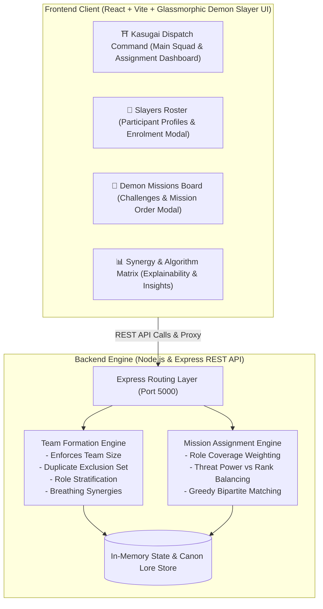

# 🗡️ Demon Slayer Corps: Kasugai Squad Formation & Mission Deployment Platform (鬼殺隊 隊士編成と任務指令録)

> **Problem ID:** PS-10 | **Domain:** Collaborative Systems & AI  
> **Theme:** Demon Slayer: Kimetsu no Yaiba (鬼滅の刃)

An intelligent, full-stack platform designed for Master Kagaya Ubuyashiki (Oyakata-sama) and the Hashira Council to dynamically assemble balanced squads of Demon Slayers and dispatch them to active Demon Incursion missions across Japan.

---

## ⛩️ Lore Hook & Concept

Following the tragic events at Mount Natagumo where uncoordinated slayers were overwhelmed by the Spider Family, the Demon Slayer Corps Headquarters implemented the **Kasugai Dispatch Matrix**:
- **Slayers (Participants):** Mizunoto recruits to Hashiras, cataloged by Breathing Style, Tactical Combat Role, Combat Power Index, Skills, and Interests.
- **Missions (Challenges):** Demon Incursions graded by Danger Threat Rating (Rank D patrol to Rank S Upper Moon raids), requiring specific tactical roles and counter-breathing elements.
- **Smart Formation Engine:** Assembles synergistic squads of configurable size ($2$ to $6$ slayers) while **strictly guaranteeing zero duplicate assignments**, balancing roles (Vanguard, Recon, Tactician, Medical, Trapper), and unlocking elemental breathing resonances (e.g. *Flowing Lightning Convergence*, *Dead Calm Venom Weave*).
- **Mission Assignment Engine:** Evaluates squad combat capability against mission requirements and assigns each squad to the optimal demon threat tier with an explainable compatibility score.

---

## 🏛️ System Architecture



---

## ⚙️ Key Requirements Matrix

| Requirement | Implementation Detail | Status |
| :--- | :--- | :---: |
| **Create participant profiles** | Interactive form/modal for enrolling slayers with full profile data | ✅ |
| **Add skills and interests** | Array-based tags for special forms, breathing techniques, and personal hobbies | ✅ |
| **Add preferred roles** | 5 tactical roles: Vanguard, Recon, Tactician, Medical (Kakushi), Trapper | ✅ |
| **Display participant info** | Filterable Directory with rank badges, combat power meters, and techniques | ✅ |
| **Create activities/challenges** | Mission creation modal with threat rank, demon encounter, and locations | ✅ |
| **Set team size** | Interactive 2 to 6 slayers-per-squad selector with real-time target recalculation | ✅ |
| **Define required skills/roles** | Missions specify mandatory tactical roles, counter breathing styles, and min power | ✅ |
| **Generate teams** | Smart multi-objective constraint engine balancing roles & combat power | ✅ |
| **Consider skills and roles** | Stratified role seeding + elemental breathing resonance bonus calculation | ✅ |
| **Prevent duplicate assignment** | Strict ID tracking ensures every slayer is assigned to at most ONE team | ✅ |
| **Display team members & roles** | Squad cards show member names, Japanese kanji, breathing styles, roles & ranks | ✅ |
| **Allow teams to be regenerated** | One-click "Re-dispatch Crows (Regenerate)" button with randomized jitter | ✅ |
| **Assign challenges to teams** | Smart suitability matcher assigning optimal missions to squads | ✅ |
| **Display assigned team & challenge** | Squad cards feature mission banner with match percentage & tactical reasons | ✅ |
| **Demon Slayer Theme** | Complete custom CSS design with Wisteria purple, Nichirin crimson, procedural Web Audio SFX & confetti | ✅ |

---

## 🚀 Running the Project Locally

### 1. Prerequisites
- **Node.js** (v18+ or v24+)
- **npm** (v9+)

### 2. Quick Start (Run Both Server & Client)
From the project root:
```bash
# 1. Install root dependencies (concurrently)
npm install

# 2. Run both backend server (port 5000) and frontend client (port 3000)
npm run dev
```

Or run them individually in separate terminals:
```bash
# Backend Server
cd server
npm install
node index.js   # Runs on http://localhost:5000

# Frontend Client
cd client
npm install
npm run dev     # Runs on http://localhost:3000
```

### 3. Open in Browser
Visit **`http://localhost:3000`** in your browser to interact with the platform!

---

## 🧪 REST API Reference

| Endpoint | Method | Description |
| :--- | :---: | :--- |
| `/api/slayers` | `GET` | List all slayers (supports `?role=`, `?breathing=`, `?assigned=`) |
| `/api/slayers` | `POST` | Enroll a new slayer profile |
| `/api/slayers/:id` | `DELETE` | Discharge a slayer from active service |
| `/api/missions` | `GET` | List all demon incursion challenges |
| `/api/missions` | `POST` | Issue a new demon incursion mission order |
| `/api/missions/:id` | `DELETE` | Archive a mission |
| `/api/teams` | `GET` | Fetch formed squads, reserve members, and metadata |
| `/api/teams/generate` | `POST` | Assemble synergistic squads based on `{ teamSize }` |
| `/api/teams/regenerate` | `POST` | Shuffle and generate an alternative balanced team permutation |
| `/api/assignments/assign` | `POST` | Match formed squads to demon incursion missions |
| `/api/assignments/reset` | `POST` | Clear current mission assignments |
| `/api/reset` | `POST` | Restore database back to canon Demon Slayer roster & missions |
| `/api/overview` | `GET` | Global stats (headcount, readiness index, squads formed) |