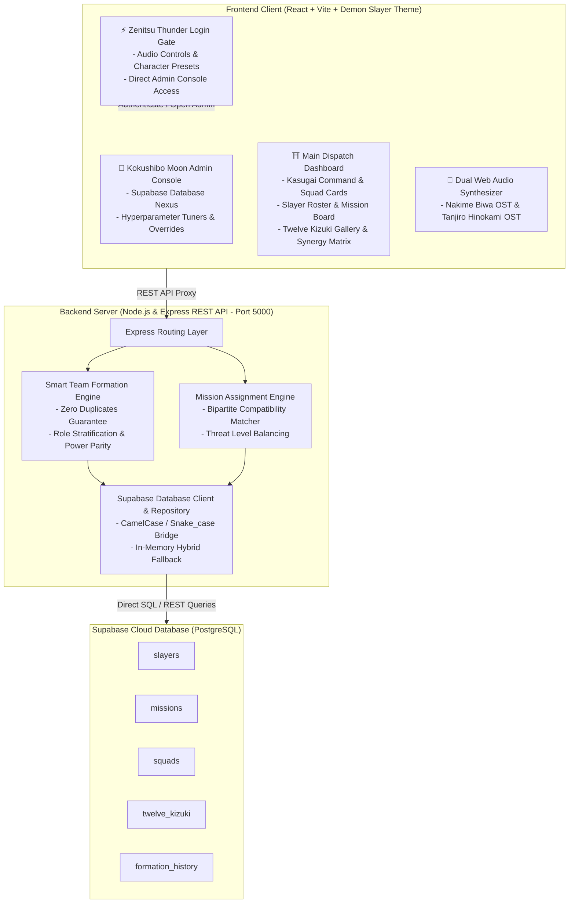

# 🗡️ Demon Slayer Corps: Kasugai Squad Formation & Mission Deployment Platform
### 鬼殺隊 隊士編成と任務指令録 • Smart Team Formation & Challenge Assignment Platform

> **Problem Statement ID:** PS-10 | **Domain:** Collaborative Systems & Algorithmic Assignment  
> **Theme:** Demon Slayer: Kimetsu no Yaiba (鬼滅の刃)  
> **Database:** Supabase PostgreSQL Cloud Database (with In-Memory Graceful Fallback)  
> **Audio:** Web Audio Synthesizer (Nakime Biwa & Kamado Tanjiro no Uta Soundtracks)

An intelligent, full-stack dispatch platform built for Master Kagaya Ubuyashiki (Oyakata-sama) and the Demon Slayer Corps Headquarters to dynamically assemble balanced squads of Demon Slayers and dispatch them to active Demon Incursion missions across Japan.

---

## ⛩️ Lore Hook & Core Philosophy

Following the catastrophic casualties at Mount Natagumo caused by uncoordinated slayers confronting the Spider Family, the Hashira Council instituted the **Kasugai Dispatch Matrix**:
- **Slayers (Participants):** Cataloged from Mizunoto recruits to Hashiras by Breathing Style, Tactical Combat Role, Combat Power Index, Skills, and Interests.
- **Missions (Challenges):** Incursions graded by Danger Threat Rating (Rank D patrol to Rank S Upper Moon raids), requiring specific tactical roles and counter-breathing elements.
- **Smart Formation Engine:** Assembles synergistic squads of configurable size ($2$ to $6$ slayers) while **strictly guaranteeing zero duplicate assignments**, balancing 5 tactical roles (Vanguard, Recon, Tactician, Medical/Kakushi, Trapper), and unlocking elemental breathing resonances (e.g., *Flowing Lightning Convergence*, *Dead Calm Venom Weave*).
- **Mission Assignment Engine:** Evaluates squad combat capability against mission requirements and assigns each squad to the optimal demon threat tier with an explainable compatibility score.

---

## 🌟 Key Features & Innovations

### 1. ⚡ Zenitsu Thunder Breathing Login Gate
- **High-Impact Visuals:** Right-aligned glassmorphic authentication card leaving Zenitsu's iconic Thunder Breathing stance and face completely unobstructed on the left.
- **Procedural Canvas:** Live procedural lightning strikes, electrical sparks, and golden thunderclap particle effects.
- **Fast Character Presets:** One-click instant login as **Zenitsu Agatsuma** (Thunder), **Tanjiro Kamado** (Sun/Water), or **Master Ubuyashiki** (Supreme Commander Admin).
- **Direct Gateway Admin Access:** Enter the Kokushibo Moon Admin Console directly from the login screen without needing to navigate inside regular slayer views.

### 2. 🪕 Dual Demon Slayer Soundtracks (Web Audio Synthesizer)
Engineered entirely in the browser using the Web Audio API without bulky external MP3 dependencies:
- **Track 1: Nakime's Biwa (鳴女 琵琶 鳴響 - Infinity Castle Guitar OST):**  
  Accurately synthesizes silk string *sawari* buzz resonance, wooden plectrum (*bachi*) transient attack, microtonal *yuri* pitch-bending, and cavernous fortress acoustics.
- **Track 2: Kamado Tanjiro no Uta / Hinokami Kagura Theme (竈門炭治郎のうた / ヒノカミ神楽):**  
  Emotive melody featuring traditional *shakuhachi* bamboo flute with breath vibrato, *koto* harp arpeggios, and rhythmic *taiko* war drum percussion.
- **Procedural Combat SFX:** Nichirin blade slashes, Kasugai crow calls, chime notifications, and victory fanfare.

### 3. 🌙 Kokushibo Moon Breathing Supreme Admin Console (上弦の壱 黒死牟 司令盤)
Directly accessible from the Login Gate:
- **Upper Rank 1 Aesthetic:** Themed after Kokushibo's Moon Breathing with floating crescent blades and deep twilight crimson styling.
- **Algorithm Hyperparameter Modulation:** Real-time sliders for Role Stratification Priority, Elemental Resonance Multipliers, and Combat Power Parity Tolerance.
- **Emergency Overrides:** One-click buttons to strike Nakime's Biwa, trigger Upper Moon Incursions, spawn Hashira reinforcements, or disband squads.
- **Live Telemetry & State Inspector:** Kasugai Crow real-time audit stream and raw JSON state inspector across slayers, missions, squads, and database tables.

### 4. ⚡ Supabase PostgreSQL Cloud Database Nexus
- **Complete Schema ([`supabase_schema.sql`](./supabase_schema.sql)):** 5 relational tables (`slayers`, `missions`, `squads`, `twelve_kizuki`, `formation_history`) with Row Level Security (RLS) policies.
- **Pre-Seeded Canon Lore:** 16 canon Demon Slayers, 7 Missions, and 10 Kizuki Demons ready to run.
- **Hybrid Graceful Architecture:** Automatically uses cloud Supabase when configured, with high-speed In-Memory fallback if offline or prior to configuration.
- **Admin Cloud Hub:** Test connection ping, copy PostgreSQL SQL schema to clipboard, and seed canon lore with one click directly from the Admin Console.
- **Detailed Setup Guide:** See [`SUPABASE_GUIDE.md`](./SUPABASE_GUIDE.md).

---

## 🏛️ System Architecture



---

## ⚙️ Key Requirements & Compliance Matrix

| Requirement | Implementation Detail | Status |
| :--- | :--- | :---: |
| **Create participant profiles** | Interactive form/modal for enrolling slayers with breathing, rank, and role | ✅ |
| **Add skills and interests** | Array-based tags for forms, breathing styles, and personal hobbies | ✅ |
| **Add preferred roles** | 5 tactical roles: Vanguard, Recon, Tactician, Medical (Kakushi), Trapper | ✅ |
| **Display participant info** | Filterable directory with rank badges, combat power meters, and techniques | ✅ |
| **Create activities/challenges** | Mission creation modal with threat rank, demon encounter, and locations | ✅ |
| **Set team size** | Interactive 2 to 6 slayers-per-squad selector with real-time target recalculation | ✅ |
| **Define required skills/roles** | Missions specify mandatory tactical roles, counter breathing styles, and min power | ✅ |
| **Generate teams** | Smart multi-objective constraint engine balancing roles & combat power | ✅ |
| **Consider skills and roles** | Stratified role seeding + elemental breathing resonance bonus calculation | ✅ |
| **Prevent duplicate assignment** | Strict ID tracking ensures every slayer is assigned to at most ONE team | ✅ |
| **Display team members & roles** | Squad cards show member names, Japanese kanji, breathing styles, roles & ranks | ✅ |
| **Allow teams to be regenerated** | One-click "Re-dispatch Crows (Regenerate)" button with randomized jitter | ✅ |
| **Assign challenges to teams** | Smart suitability matcher assigning optimal missions to squads | ✅ |
| **Display assigned team & challenge** | Squad cards feature mission banner with match percentage & tactical reasons | ✅ |
| **Admin Panel on Login Page** | Kokushibo Moon Admin Console accessible directly from the login gateway | ✅ |
| **Demon Slayer Soundtracks** | Dual synthesizers for Nakime Biwa and Kamado Tanjiro no Uta | ✅ |
| **Database Integration** | Full Supabase PostgreSQL schema, automated migration script & seeding | ✅ |

---

## 🚀 Getting Started

### 1. Prerequisites
- **Node.js** (v18+ or v24+)
- **npm** (v9+)

### 2. Installation
Clone the repository and install dependencies:
```bash
git clone https://github.com/abhishek111mailcom-dot/Smart-Team-Formation-and-Challenge-Assignment-Platform.git
cd Smart-Team-Formation-and-Challenge-Assignment-Platform

# Install root dependencies
npm install

# Install server dependencies
cd server && npm install && cd ..

# Install client dependencies
cd client && npm install && cd ..
```

### 3. Running Locally
Run both server (port 5000) and client (port 3000) concurrently:
```bash
npm run dev
```

Visit **`http://localhost:3000`** in your browser!

---

## 🗄️ Supabase Cloud Database Setup

Connecting to Supabase takes less than 1 minute:

1. **Create Free Project**: Sign in at [https://supabase.com/dashboard](https://supabase.com/dashboard) and create a project.
2. **Run SQL Schema**: Open the **SQL Editor** in Supabase, paste the contents of [`supabase_schema.sql`](./supabase_schema.sql) (or click **"Copy SQL Schema"** inside the Admin Console), and click **Run**.
3. **Connect**: Copy your **Project URL** and **Anon API Key** from **Project Settings → API** and paste them into the Admin Console's **Supabase Nexus** card (or add to `server/.env`).

```env
PORT=5000
SUPABASE_URL=https://your-project-ref.supabase.co
SUPABASE_KEY=your-anon-or-service-role-key
```

*For more details, see [`SUPABASE_GUIDE.md`](./SUPABASE_GUIDE.md).*

---

## 🧪 REST API Reference

| Endpoint | Method | Description |
| :--- | :---: | :--- |
| `/api/slayers` | `GET` | List all slayers (supports `?role=`, `?breathing=`, `?assigned=`) |
| `/api/slayers` | `POST` | Enroll a new slayer into Corps and Supabase |
| `/api/slayers/:id` | `DELETE` | Discharge a slayer from active service |
| `/api/missions` | `GET` | List all demon incursion missions |
| `/api/missions` | `POST` | Issue a new demon incursion mission order |
| `/api/missions/:id` | `DELETE` | Archive a mission |
| `/api/demons` | `GET` | List ranked Twelve Kizuki and incursion demons |
| `/api/teams` | `GET` | Fetch formed squads, reserve slayers, and formation metadata |
| `/api/teams/generate` | `POST` | Assemble synergistic squads based on `{ teamSize }` |
| `/api/teams/regenerate` | `POST` | Shuffle and generate an alternative balanced team permutation |
| `/api/assignments/assign` | `POST` | Smart-match formed squads to demon incursion missions |
| `/api/assignments/reset` | `POST` | Clear current mission assignments |
| `/api/database/status` | `GET` | Check live Supabase connection status and cloud row counts |
| `/api/database/config` | `POST` | Save Supabase credentials and connect on the fly |
| `/api/database/seed` | `POST` | Seed canon Demon Slayer lore into Supabase Cloud |
| `/api/database/schema` | `GET` | Retrieve the complete PostgreSQL schema SQL text |
| `/api/reset` | `POST` | Restore database back to canon Demon Slayer roster & missions |
| `/api/overview` | `GET` | Global statistics (readiness index, headcount, active squads) |

---

## 📜 License & Acknowledgments

- **Inspiration:** *Demon Slayer: Kimetsu no Yaiba* (鬼滅の刃) by Koyoharu Gotouge / ufotable / Shueisha.
- **Audio Synthesizer:** Pure Web Audio API procedural synthesis.
- **Built for:** Collaborative Systems & Algorithmic Assignment (Problem Statement PS-10).